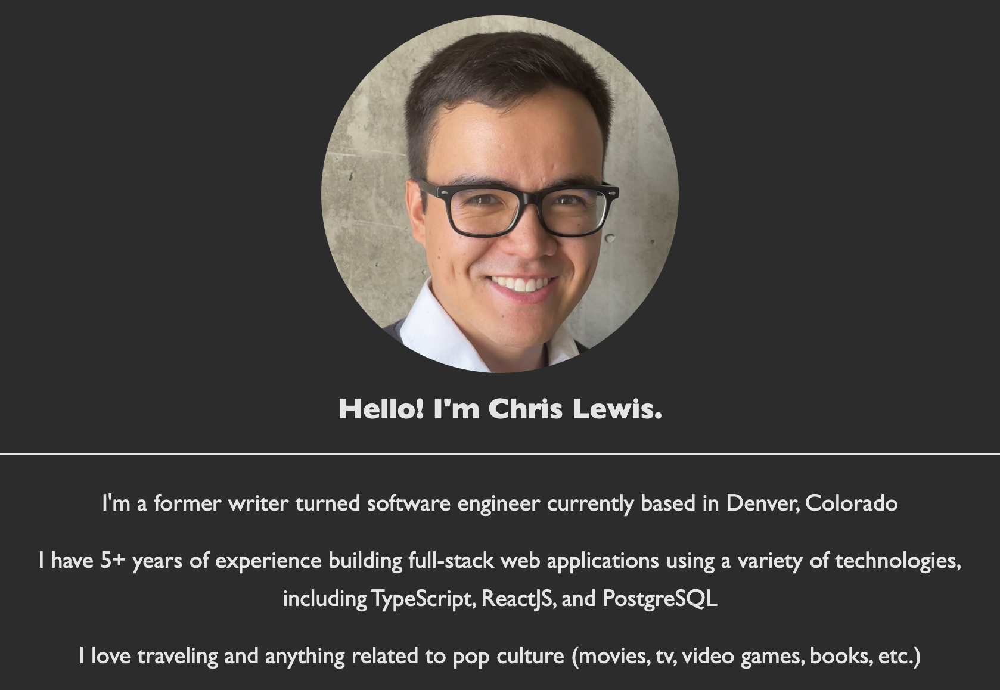

<a id="readme-top"></a>
<br />

<div align="center">
<h3 align="center">Personal Site</h3>

  <p align="center">
    A simple personal site built using <a href="https://astro.build/">Astro</a> and hosted with <a href="https://www.netlify.com/">Netlify</a>
  </p>
</div>

<details>
  <summary>Table of Contents</summary>
  <ol>
    <li>
      <a href="#about-the-project">About The Project</a>
      <ul>
        <li><a href="#built-with">Built With</a></li>
      </ul>
    </li>
    <li><a href="#contact">Contact</a></li>
  </ol>
</details>

## About The Project

This project is a simple website built with [Astro][Astro-url] and hosted with [Netlify][Netlify-url] at https://csvlewis.com to display a short "About Me" page with links to my other online profiles and contact information.



The static website is comprised of mostly text, pictures, and links. I purchased and configured the https://csvlewis.com web domain using [Porkbun][Porkbun-url]. I configured email hosting/forwarding with Porkbun to enable a personal email address at chris@csvlewis.com.

I also added a route at https://csvlewis.com/resume where you can view and download my current resume. Simply visit the URL to see the PDF file displayed in the browser.

<p align="right">(<a href="#readme-top">back to top</a>)</p>

## Running Locally

To run this Astro project locally, follow these steps:

1. **Clone the repository**

```bash
git clone https://github.com/csvlewis/personal-site.git
cd personal-site
```

2. **Install dependencies**
   Make sure you have Node.js installed. Then, install the project dependencies:

```bash
npm install
```

3. **Install dependencies**
   Launch the Astro dev server and open the site in your browser at http://localhost:4321/:

```bash
npm run dev
```

### Built With

- [![Astro][Astro]][Astro-url]
- [![Netlify][Netlify]][Netlify-url]
- [![Porkbun][Porkbun]][Porkbun-url]

<p align="right">(<a href="#readme-top">back to top</a>)</p>

## Contact

Christopher Lewis - [LinkedIn][Linkedin-url] - Email: chris@csvlewis.com

Project Link: [https://github.com/csvlewis/pokemon-quiz](https://github.com/csvlewis/pokemon-quiz)

<p align="right">(<a href="#readme-top">back to top</a>)</p>

[Astro]: https://img.shields.io/badge/Astro-BC52EE?style=for-the-badge&logo=astro&logoColor=white
[Netlify]: https://img.shields.io/badge/Netlify-00C7B7?style=for-the-badge&logo=netlify&logoColor=white
[Porkbun]: https://img.shields.io/badge/Porkbun-EF7878?style=for-the-badge&logo=porkbun&logoColor=white
[Astro-url]: https://astro.build/
[Netlify-url]: https://www.netlify.com/
[Porkbun-url]: https://porkbun.com/
[Linkedin-url]: https://linkedin.com/in/csvlewis
